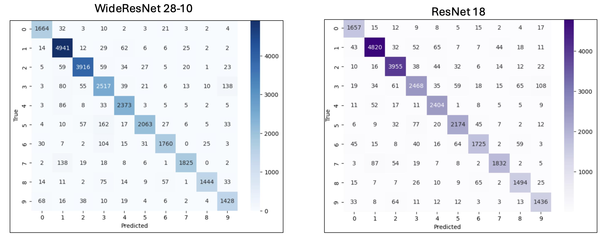
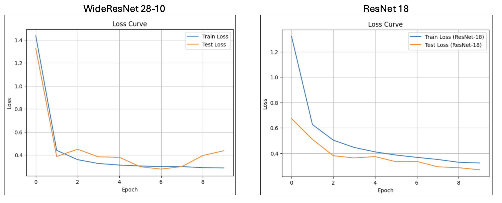
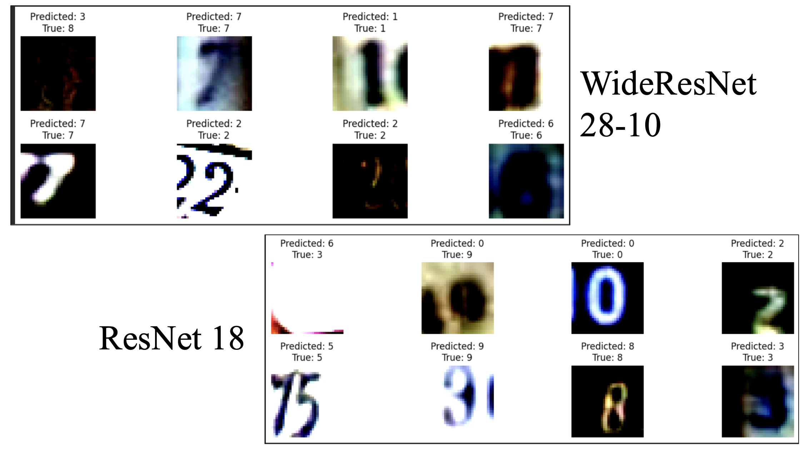

# SVHN Digit Recognition with PyTorch

This project explores image classification on the SVHN dataset using two deep learning models implemented in PyTorch:
- WideResNet-28-10
- ResNet-18

The work includes training, evaluation, comparison, visualization, and custom image inference.

## Overview

The SVHN dataset contains cropped street view house number images for digit recognition.

This repository includes:
- dataset download and loading
- data augmentation and normalization
- WideResNet-28-10 implementation
- ResNet-18 comparison baseline
- training and evaluation loops
- confusion matrices
- loss and accuracy curves
- per class accuracy
- misclassification analysis
- custom image prediction

### Confusion Matrix

  
## Models

### WideResNet-28-10
A wider residual architecture used here as the main model.

### ResNet-18
A second architecture used as a comparison baseline.

## Results Summary

In the recorded training runs:
- WideResNet-28-10 achieved a best test accuracy of 91.93%
- ResNet-18 achieved a best test accuracy of 92.06%

### Loss Curve

### Misclassification

